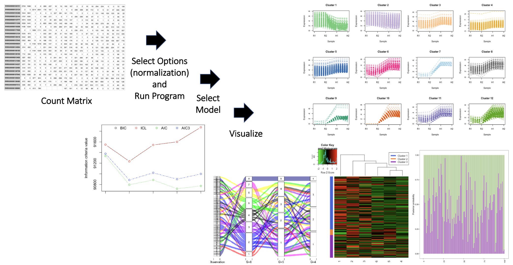
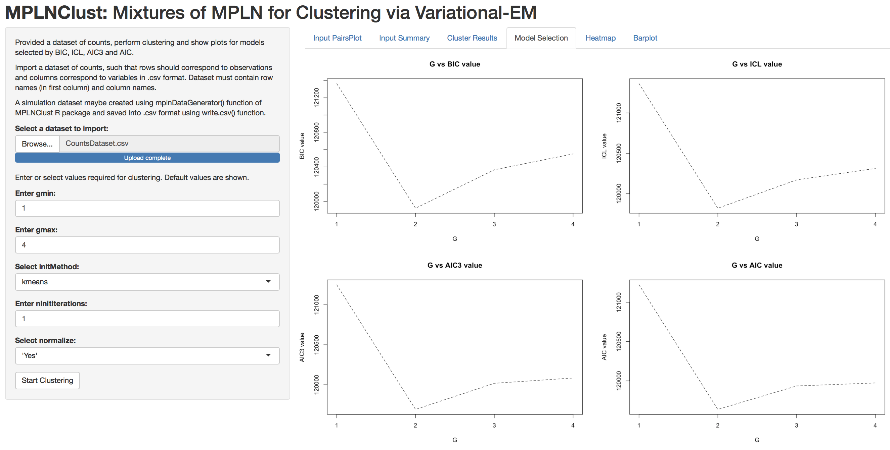

<!-- README.md is generated from README.Rmd. Please edit that file -->

```{r, include = FALSE}
knitr::opts_chunk$set(
  collapse = TRUE,
  comment = "#>",
  fig.path = "man/figures/README-",
  out.width = "100%"
)
```

# MPLNClust
Mixtures of Multivariate Poisson-Log Normal Model for Clustering Count Data

<!-- badges: start -->
<!-- https://www.codefactor.io/repository/github/anjalisilva/MPLNClust/issues -->
<!-- [](https://www.codefactor.io/repository/github/anjalisilva/mplnclust)-->
[](https://github.com/anjalisilva/MPLNClust/issues)  [](./LICENSE)  

<!-- https://shields.io/category/license -->
<!-- badges: end -->

## Description
`MPLNClust` is an R package for performing clustering using mixtures of multivariate Poisson-log normal (MPLN) distribution proposed by [Silva et al., 2019](https://pubmed.ncbi.nlm.nih.gov/31311497/). It was developed for count data, with clustering of RNA sequencing data as a motivation. However, the clustering method may be applied to other types of count data. The package provides functions for functions for parameter estimation via  1) an MCMC-EM framework by [Silva et al., 2019](https://pubmed.ncbi.nlm.nih.gov/31311497/) and 2) a variational Gaussian approximation with EM algorithm by [Subedi and Browne, 2020](https://doi.org/10.1002/sta4.310). Information criteria (AIC, BIC, AIC3 and ICL) and slope heuristics (Djump and DDSE, if more than 10 models are considered) are offered for model selection. Also included are functions for simulating data from this model and visualization. 

## Installation

To install the latest version of the package:

``` r
require("devtools")
devtools::install_github("anjalisilva/MPLNClust", build_vignettes = TRUE)
library("MPLNClust")
```

To run the Shiny app:
``` r
MPLNClust::runMPLNClust()
```


## Overview

To list all functions available in the package: 

``` r
ls("package:MPLNClust")
```

`MPLNClust` contains 10 functions. For carrying out clustering of count data using mixtures of MPLN via variational expectation-maximization (EM): __*mplnVariational*__. Functions __*mplnMCMCParallel*__ or __*mplnMCMCNonParallel*__ uses a Markov chain Monte Carlo expectation-maximization algorithm (MCMC-EM) for parameter estimation. Function *mplnMCMCParallel* uses MCMC-EM with parallelization while *mplnMCMCNonParallel* uses MCMC-EM with no parallelization. For the purpose of generating simlulation data via mixtures of MPLN: __*mplnDataGenerator*__. For visualizing clustering results: __*mplnVisualize*__. Information criteria are offered for model selection: __*AICFunction*__, __*BICFunction*__, __*AIC3Function*__, __*ICLFunction*__. The shiny implementation of *mplnVariational*: __*runMPLNClust*__. 

Framework of __*mplnVariational*__ makes it computationally efficient and faster compared to __*mplnMCMCParallel*__ or __*mplnMCMCNonParallel*__. Therefore, __*mplnVariational*__ may perform better for large datasets. For more information, see details section below. 

An overview of the package is illustrated below:

<div style="text-align:center">

<div style="text-align:left">
<div style="text-align:left">
<div style="text-align:left">

Alternatively, the Shiny app employing __*mplnVariational*__ could be run and results could be visualized:
``` r
MPLNClust::runMPLNClust()
```

<div style="text-align:center">
  
<div style="text-align:left">
<div style="text-align:left">

## Details

The MPLN distribution ([Aitchison and Ho, 1989](https://www.jstor.org/stable/2336624?seq=1)) is a multivariate log normal mixture of independent Poisson distributions. The hidden layer of the MPLN distribution is a multivariate Gaussian distribution, which allows for the specification of a covariance structure. Further, the MPLN distribution can account for overdispersion in count data. Additionally, the MPLN distribution supports negative and positive correlations.

A mixture of MPLN distributions is introduced for clustering count data by [Silva et al., 2019](https://pubmed.ncbi.nlm.nih.gov/31311497/). Here, applicability is illustrated using RNA sequencing data. To this date, two frameworks have been proposed for parameter estimation: 1) an MCMC-EM framework by [Silva et al., 2019](https://pubmed.ncbi.nlm.nih.gov/31311497/) and 2) a variational Gaussian approximation with EM algorithm by [Subedi and Browne, 2020](https://doi.org/10.1002/sta4.310). 

### MCMC-EM Framework for Parameter Estimation 

[Silva et al., 2019](https://pubmed.ncbi.nlm.nih.gov/31311497/) used an MCMC-EM framework via Stan for parameter estimation. This method is employed in functions __*mplnMCMCParallel*__ and __*mplnMCMCNonParallel*__. 

Coarse grain parallelization is employed in *mplnMCMCParallel*, such that when a range of components/clusters (g = 1,...,G) are considered, each component/cluster size is run on a different processor. This can be performed because each component/cluster size is independent from another. All components/clusters in the range to be tested have been parallelized to run on a separate core using the *parallel* R package. The number of cores used for clustering is calculated using *parallel::detectCores() - 1*. No internal parallelization is performed for *mplnMCMCNonParallel*. 

To check the convergence of MCMC chains, the potential scale reduction factor and the effective number of samples are used. The Heidelberger and Welch’s convergence diagnostic (Heidelberger and Welch, 1983) is used to check the convergence of the MCMC-EM algorithm. The AIC, BIC, AIC3 and ICL are used for model selection. Starting values (argument: initMethod) and the number of iterations for each chain (argument: nIterations) play an important role for the successful operation of this algorithm. 

### Variational-EM Framework for Parameter Estimation 
[Subedi and Browne, 2020](https://doi.org/10.1002/sta4.310) proposed a variational Gaussian approximation that alleviates challenges of MCMC-EM algorithm. Here the posterior distribution is approximated by minimizing the Kullback-Leibler (KL) divergence between the true and the approximating densities. A variational-EM based framework is used for parameter estimation. This algorithm is implemented in the function __*mplnVariational*__. 


  
## Tutorials  
  
For tutorials and plot interpretation, refer to the vignette:

``` r
browseVignettes("MPLNClust")
```

or see [A tour of MPLNClust with MCMC-EM](https://github.com/anjalisilva/MPLNClust/blob/master/vignettes/Introduction_MPLNClust_MCMCEM.md) and [A tour of MPLNClust with variational-EM](https://github.com/anjalisilva/MPLNClust/blob/master/vignettes/Introduction_MPLNClust_variationalEM.md).
  


## Citation for Package
``` r
citation("MPLNClust")
```
Silva, A., S. J. Rothstein, P. D. McNicholas, and S. Subedi (2019). A multivariate Poisson-log normal mixture model for clustering transcriptome sequencing data. *BMC Bioinformatics*. 2019;20(1):394.
``` r
A BibTeX entry for LaTeX users is

  @Article{,
    title = {A multivariate Poisson-log normal mixture model for clustering transcriptome sequencing data},
    author = {A. Silva and S. J. Rothstein and P. D. McNicholas and S. Subedi},
    journal = {BMC Bioinformatics},
    year = {2019},
    volume = {20},
    number = {1},
    pages = {394},
    url = {https://pubmed.ncbi.nlm.nih.gov/31311497/},
  }
```

## References for Package

* [Silva, A., S. J. Rothstein, P. D. McNicholas, and S. Subedi (2019). A multivariate Poisson-log normal mixture model for clustering transcriptome sequencing data. *BMC Bioinformatics.*](https://pubmed.ncbi.nlm.nih.gov/31311497/)

* [Subedi, S., R.P. Browne (2020). A family of parsimonious mixtures of multivariate Poisson-lognormal distributions for clustering multivariate count data. *Stat.* 9:e310.](https://doi.org/10.1002/sta4.310)

* [Aitchison, J. and C. H. Ho (1989). The multivariate Poisson-log normal distribution. *Biometrika.*](https://www.jstor.org/stable/2336624?seq=1)

* For others, refer to help page of inidividual functions via `?function` or `help(function)`.


## Maintainer

* Anjali Silva (anjali@alumni.uoguelph.ca). 


## Contributions

`MPLNClust` welcomes issues, enhancement requests, and other contributions. To submit an issue, use the [GitHub issues](https://github.com/anjalisilva/MPLNClust/issues).


## Acknowledgments

* Dr. Marcelo Ponce, SciNet HPC Consortium, University of Toronto, ON, Canada for all the computational support. 
* This work was funded by Natural Sciences and Engineering Research Council of Canada, Queen Elizabeth II Graduate Scholarship, and Arthur Richmond Memorial Scholarship.
