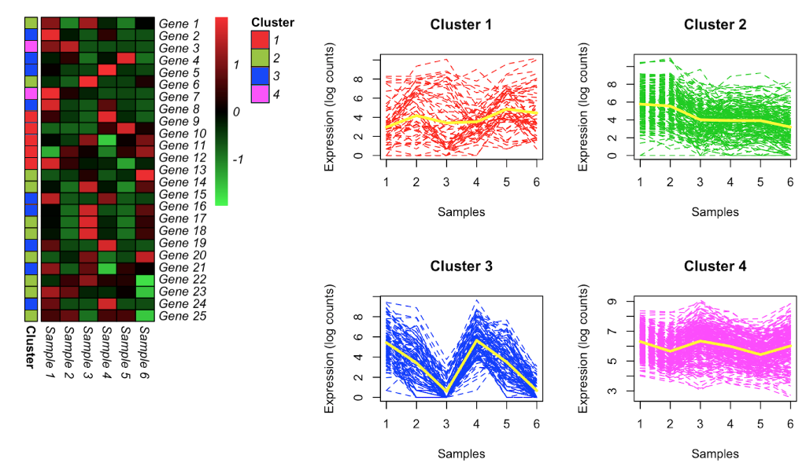

# MPLNClust

## Description
MPLNClust is a package for performing clustering using mixtures of multivariate Poisson-log normal (MPLN) distribution for count data. It was developed for count data arising from RNA sequencing studies. However, the vector of normalization factors can be relaxed and clustering method may be applied to other types of count data. 

Main function *mpln* carries out model-based clustering using mixtures of MPLN model. Markov chain Monte Carlo expectation-maximization algorithm (MCMC-EM) is used for parameter estimation. Information criteria (AIC, BIC, AIC3 and ICL) and slope heuristics (Djump and DDSE) are offered for model selection. For more, see details. 

## Installation

To install the latest version of the package:

``` r
require("devtools")
install_github("anjalisilva/MPLNClust", build_vignettes = TRUE)
library("MPLNClust")
```

## Overview

``` r
browseVignettes("MPLNClust")
lsf.str("package:MPLNClust")
```

MPLNClust contains 3 functions for the purpose of generating simlulation data via mixtures of MPLN: *mplnDataGenerator()*, carrying out clustering of count data using mixtures of MPLN: *mpln()*, and for visualizing clustered data: *mplnVisualize()*. 


## Details

The MPLN distribution (Aitchison and Ho, 1989) is a multivariate log normal mixture of independent Poisson distributions. The hidden layer of the MPLN distribution is a multivariate Gaussian distribution, which allows for the specification of a covariance structure. Further, the MPLN distribution can account for overdispersion in count data. 

A mixture of MPLN distributions is introduced for clustering count data from RNA sequencing using the approach of [Silva et al., 2019](https://bmcbioinformatics.biomedcentral.com/articles/10.1186/s12859-019-2916-0). The MCMC-EM algorithm via Stan is used for parameter estimation. Coarse grain parallelization is employed, such that when a range of components/clusters (G) are considered, each G is run on a different processor. To check the convergence of MCMC chains, the potential scale reduction factor and the effective number of samples are used. The Heidelberger and Welch’s convergence diagnostic (Heidelberger and Welch, 1983) is used to check the convergence of the MCMC-EM algorithm. 

The AIC, BIC, AIC3 and ICL are used for model selection. If more than 10 models are considered, slope heuristics (Djump and DDSE) can also be used. Starting values (initMethod) and the number of iterations for each chain (nIterations) play an important role for the successful operation of this algorithm. The *mplnVisualize()* function can be used to generate heatmaps and line plots of clusters. 



## References

[Silva, A., S. J. Rothstein, P. D. McNicholas, and S. Subedi (2019). A multivariate Poisson-log normal mixture model for clustering transcriptome sequencing data. *BMC Bioinformatics*](https://bmcbioinformatics.biomedcentral.com/articles/10.1186/s12859-019-2916-0)

## Maintainer
* Anjali Silva (anjali.silva@uhnresearch.ca)

## Acknowledgments

* Dr. Marcelo Ponce, SciNet HPC Consortium, University of Toronto, ON, Canada for all the computational support. 
* This work was funded by Natural Sciences and Engineering Research Council of Canada, Queen Elizabeth II Graduate Scholarship, and Arthur Richmond Memorial Scholarship.
