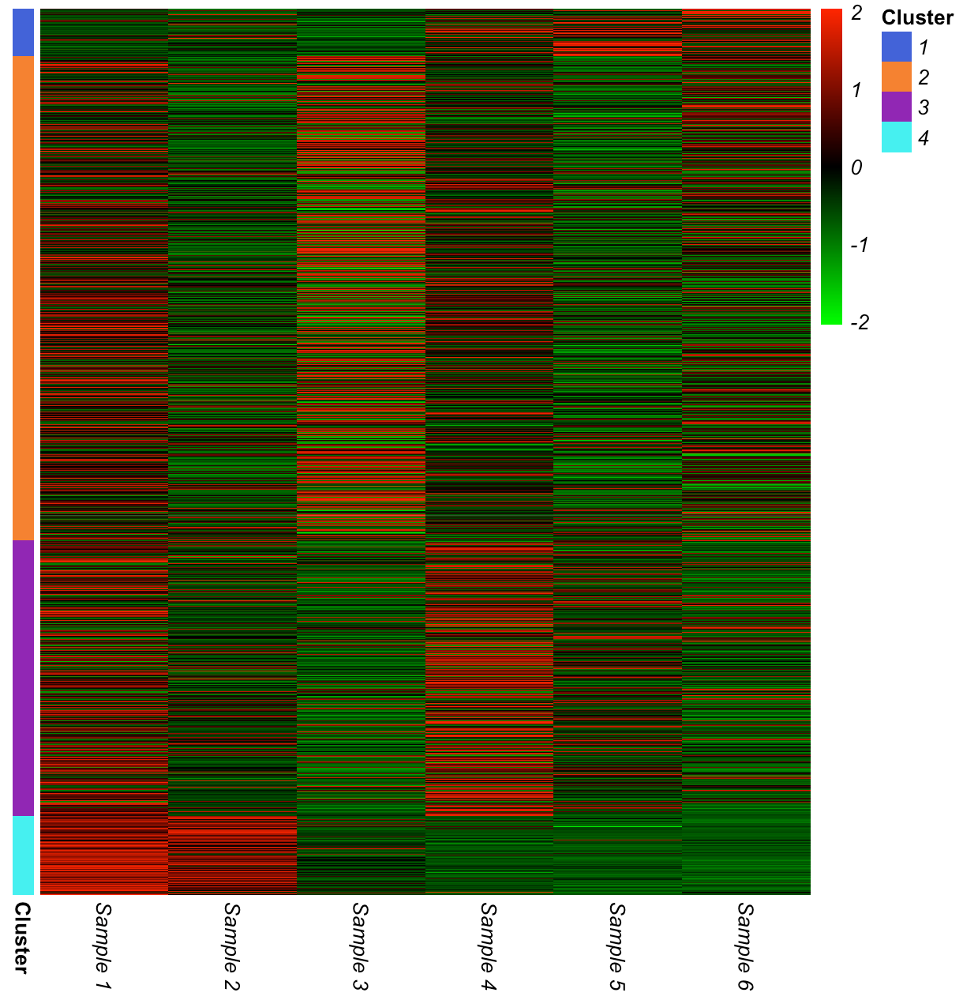
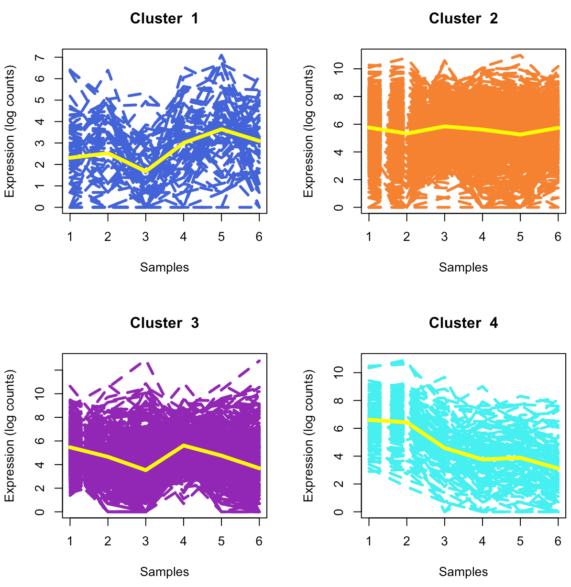

# `MPLNClust`

## Description
`MPLNClust` is an R package for performing clustering using mixtures of multivariate Poisson-log normal (MPLN) distribution. It was developed for count data arising from RNA sequencing studies. However, the vector of normalization factors can be relaxed and clustering method may be applied to other types of count data. 

Main functions, *mplnParallel* or *mplnNonParallel*, carry out model-based clustering using mixtures of MPLN model. Markov chain Monte Carlo expectation-maximization algorithm (MCMC-EM) is used for parameter estimation. Information criteria (AIC, BIC, AIC3 and ICL) are offered for model selection. For more, see details. 

## Installation

To install the latest version of the package:

``` r
require("devtools")
install_github("anjalisilva/MPLNClust", build_vignettes = TRUE)
library("MPLNClust")
```

## Overview

`MPLNClust` contains 4 functions. For the purpose of generating simlulation data via mixtures of MPLN: *mplnDataGenerator*. For carrying out clustering of count data using mixtures of MPLN with parallelization: *mplnParallel*. For carrying out clustering of count data with no parallelization: *mplnNonParallel*. For visualizing clustered data: *mplnVisualize*. 

``` r
lsf.str("package:MPLNClust")
```

For tutorials and plot interpretation, refer to the vignette.

``` r
browseVignettes("MPLNClust")
```
<p float="center">
  
  &nbsp;
  &nbsp;
  &nbsp;
  &nbsp;
  &nbsp;
  &nbsp;
  
</p>

<div style="text-align:center">

<div style="text-align:left">
<div style="text-align:left">

## Details

The MPLN distribution ([Aitchison and Ho, 1989](https://www.jstor.org/stable/2336624?seq=1)) is a multivariate log normal mixture of independent Poisson distributions. The hidden layer of the MPLN distribution is a multivariate Gaussian distribution, which allows for the specification of a covariance structure. Further, the MPLN distribution can account for overdispersion in count data. Additionally, the MPLN distribution supports negative and positive correlations.

A mixture of MPLN distributions is introduced for clustering count data from RNA sequencing using the approach of [Silva et al., 2019](https://bmcbioinformatics.biomedcentral.com/articles/10.1186/s12859-019-2916-0). The MCMC-EM algorithm via Stan is used for parameter estimation. Coarse grain parallelization is employed in *mplnParallel*, such that when a range of components/clusters (g = 1,...,G) are considered, each component/cluster size is run on a different processor. This can be performed because each component/cluster size is independent from another. All components/clusters in the range to be tested have been parallelized to run on a seperate core using the *parallel* R package. The number of cores used for clustering is calculated using *parallel::detectCores() - 1*. No internal parallelization is performed for *mplnNonParallel*. 

To check the convergence of MCMC chains, the potential scale reduction factor and the effective number of samples are used. The Heidelberger and Welch’s convergence diagnostic (Heidelberger and Welch, 1983) is used to check the convergence of the MCMC-EM algorithm. The AIC, BIC, AIC3 and ICL are used for model selection. Starting values (initMethod) and the number of iterations for each chain (nIterations) play an important role for the successful operation of this algorithm. 

## Reference

* [Silva, A., S. J. Rothstein, P. D. McNicholas, and S. Subedi (2019). A multivariate Poisson-log normal mixture model for clustering transcriptome sequencing data. *BMC Bioinformatics.*](https://bmcbioinformatics.biomedcentral.com/articles/10.1186/s12859-019-2916-0)

* [Aitchison, J. and C. H. Ho (1989). The multivariate Poisson-log normal distribution. *Biometrika.*](https://www.jstor.org/stable/2336624?seq=1)

## Maintainer

* Anjali Silva (anjali.silva@uhnresearch.ca). `MPLNClust` welcomes bug reports, enhancement requests, and other contributions. Please email anjali.silva@uhnresearch.ca with subject line 'MPLNClust: ...'. 

## Acknowledgments

* Dr. Marcelo Ponce, SciNet HPC Consortium, University of Toronto, ON, Canada for all the computational support. 
* This work was funded by Natural Sciences and Engineering Research Council of Canada, Queen Elizabeth II Graduate Scholarship, and Arthur Richmond Memorial Scholarship.
