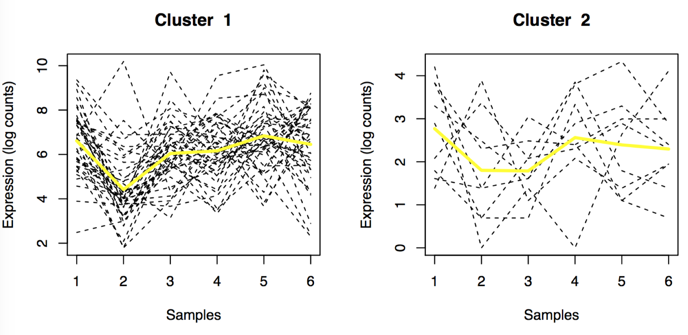
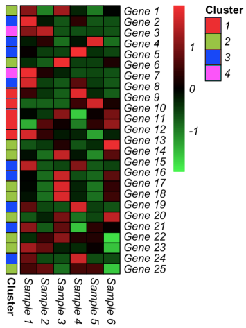

# MPLNClust

For clustering count data. Targeted at clustering count data arising from RNA sequencing studies, but the vector of normalization factors can be relaxed and clustering method may be applied to other types of count data. 

### Announcements

Version 2.0 was released. 

## Getting started

### Description

Carries out model-based clustering using mixtures of multivariate Poisson-log normal (MPLN) model. Markov chain Monte Carlo expectation-maximization algorithm (MCMC-EM) is used for parameter estimation. Information criteria (AIC, BIC, AIC3 and ICL) and slope heuristics (Djump and DDSE) are offered for model selection. See example below for more details. 

### Requirements

You will need R, git and a list of R packages in order to run MPLNClust, see below in the Installation section.

### Installation

To obtain and install a copy of MPLNClust in your computer, open a terminal
(you will need git and a internet connection!) and type:

```bash
git clone https://github.com/anjalisilva/MPLNClust.git
```

For guarantying that you have all the required R-packages for successfully running MPLNClust, a setup script has been included so that you can run with the following command:

```bash
Rscript Setup.R
```

This script will check whether the required packages are part of your R installation and if not install them in your local library.

#### Updating MPLNClust

Because MPLNClust is available under version control (git), you can easily get updates and the latest additions to MPLNClust, by simply typing the following command in the MPLNClust directory:

```bash
git pull
```

### Usage

```R
main_mpln(dataset, Gmin, Gmax, n_chains=3, n_iterations, membership=NA, init_method="kmeans", n_init_iterations=5, normalize="TMM")

```
### Arguments

```
dataset             A matrix of counts for n observations and d variables, where n > d. Assign test dataset using the variable name 'testing_dataset'.
Gmin                Lowest number of components/clusters to be tested. Should be <= Gmax. 
Gmax                Largest number of components/clusters to be tested. Should be >= Gmin. 
n_chains            A positive integer specifying the number of Markov chains. Recommended value is >= 3.  
n_iterations        A positive integer specifying the number of iterations for each chain (including warmup). The warmup is equal to 1/2 of n_iterations. Recommended value is >= number of observations (n).
membership          A vector with length equal to the number of observations (n), indicating the true memberships of each observation. If not available, use NA. 
init_method         Type of initialization strategy to be used. Methods include "kmeans", "random", "medoids", "clara", and "fanny". Default is "kmeans". If n_init_iterations is set to 0, this will be ignored. 
n_init_iterations   Number of runs to be used for the init_method, with a default value of 5. If no initialization, set to 0. 
normalize           Estimator for normalization for the differences in library size. Default is "TMM" for the trimmed mean of M values normalization method (Robinson and Oshlack, 2010). Otherwise, use NA.
```

## Details

Output of main_mpln() is an S3 object of class MPLN. 

The multivariate Poisson-log normal (MPLN; Aitchison and Ho, 1989) distribution is a multivariate log normal mixture of independent Poisson distributions. The hidden layer of the MPLN distribution is a multivariate Gaussian distribution, which allows for the specification of a covariance structure. Further, the MPLN distribution can account for overdispersion in count data. 

A mixture of MPLN distributions is introduced for clustering count data from RNA sequencing using the approach of [Silva et al., 2017](https://arxiv.org/abs/1711.11190v1). The MCMC-EM algorithm via Stan is used for parameter estimation. Coarse grain parallelization is employed, such that when a range of components/clusters (G) are considered, each G is run on a different processor. To check the convergence of MCMC chains, the potential scale reduction factor and the effective number of samples are used. The Heidelberger and Welch’s convergence diagnostic (Heidelberger and Welch, 1983) is used to check the convergence of the MCMC-EM algorithm. 

The AIC, BIC, AIC3 and ICL are used for model selection. If more than 10 models are considered, slope heuristics (Djump and DDSE) can also be used. Starting values (init_method) and the number of iterations for each chain (n_iterations) play an important role to the successful operation of this algorithm. The visualize_mpln() function can be used to generate heatmaps and lineplots of clusters. 




## Value

```
dataset                 The input matrix of size n x d.
dimensionality          The number of variables (d). 
normalization_factors   A vector of length d containing the normalization factors for the differences in library sizes.
Gmin                    Lowest number of components/clusters tested.
Gmax                    Largest number of components/clusters tested.
initalization_method    Type of initialization strategy used.
allresults              List of objects of class MPLN giving the results for all models Gmin,..., Gmax.
loglikelihood           Log-likelihood values calculated for each of the fitted models Gmin,..., Gmax.
n_parameters            Number of total parameters for each of the fitted models Gmin,..., Gmax.
truelabels              A vector of length n giving the true labels, if provided. 
ICL.all                 All ICL results, including ICL value, model selected and cluster labels. 
BIC.all                 All BIC results, including BIC value, model selected and cluster labels. 
AIC.all                 All AIC results, including AIC value, model selected and cluster labels. 
AIC3.all                All AIC3 results, including AIC3 value, model selected and cluster labels. 
SlopeHeuristics         All slope heuristics results. 
Djumpmodelselected      The model selected via Djump. 
DDSEmodelselected       The model selected via DDSE.
totaltime               Total time. 
```


## Examples

```R
# Running via R Console

# Read all the necessary functions and check that packages needed are present
source("Setup.R")

#####################################  DATA GENERATION/LOADING  #####################################
# Generating simulated data

true_mu1 <- c(6.5,6,6,6,6,6)  
true_mu2 <- c(2,2.5,2,2,2,2) 

true_sigma1 <- diag(6) * 2
true_sigma2 <- diag(6)

simulated_counts <- Datagenerator_mpln(N = 200, d = 6, pi_g = c(0.79,0.21), means = rbind(true_mu1,true_mu2), sigmas = rbind(true_sigma1,true_sigma2), ProduceImage="Yes")

#####################################################################################################

# Making RStan model 
mod = stan_model("MPLN.stan")

# Calculate the number of cores
no_cores = detectCores()-1

# Initiate cluster
cl = makeCluster(no_cores) 

# Doing clusterExport
clusterExport(cl,c("calc_likelihood","calculate_parameters","calling_clustering","cluster_mpln","initializationrun","main_mpln","mod","AIC_function","AIC3_function","BIC_function","ICL_function","remove_zero_counts","stanrun","zvalue_calculation"))

# Doing clusterEvalQ
clusterEvalQ(cl, library(parallel))
clusterEvalQ(cl, library(rstan))
clusterEvalQ(cl, library(Rcpp))
clusterEvalQ(cl, library(mclust))
clusterEvalQ(cl, library(mvtnorm))
clusterEvalQ(cl, library(edgeR))
clusterEvalQ(cl, library(capushe))
clusterEvalQ(cl, library(clusterGeneration))
clusterEvalQ(cl, library(coda))

# Running clustering for G = 1:5 
MPLNClust_results <- main_mpln(dataset=simulated_counts$dataset, 
                               membership=simulated_counts$truemembership, 
                               Gmin=1, 
                               Gmax=5, 
                               n_chains=3, 
                               n_iterations=1000, 
                               init_method="kmeans", 
                               n_init_iterations=5, 
                               normalize="TMM")

# To visualize clustered data
visualize_mpln(dataset=simulated_counts$dataset, ClusterMembershipVector=MPLNClust_results$BIC.all$BICmodelselected_labels, name="SimData")

###################################

# Runnign via terminal

Rscript Running_code.R

```

## Authors

* Anjali Silva 
* [Sanjeena Subedi](https://sanjeenadang.wordpress.com/)

## License

This project is licensed under the MIT License.

## Acknowledgments

* Dr. Marcelo Ponce, SciNet HPC Consortium, University of Toronto, ON, Canada for all the computational support. 
* This work was funded by Natural Sciences and Engineering Research Council of Canada, Queen Elizabeth II Graduate Scholarship, and Arthur Richmond Memorial Scholarship.

## References

[Silva, A., S. J. Rothstein, P. D. McNicholas, and S. Subedi (2017). A multivariate Poisson-log normal mixture model for clustering transcriptome sequencing data. arXiv preprint arXiv:1711.11190.](https://arxiv.org/abs/1711.11190v1)

## Maintainer

* Anjali Silva (anjali@alumni.uoguelph.ca)


