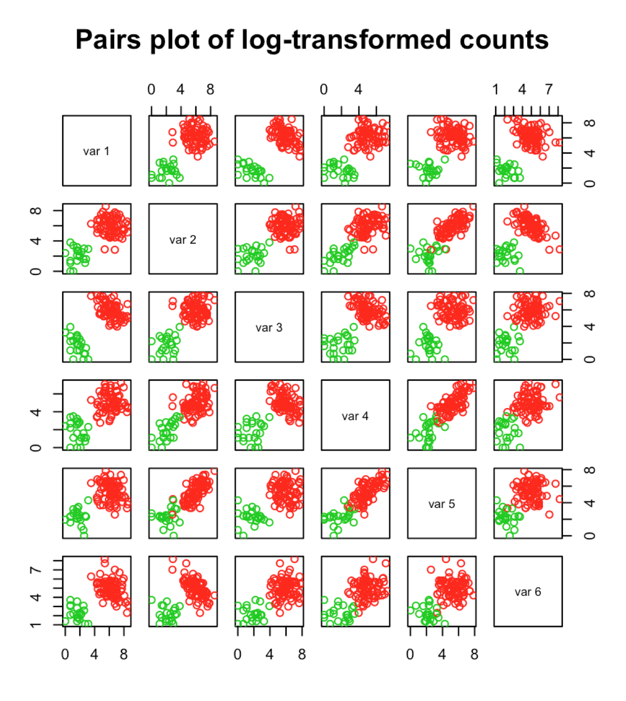
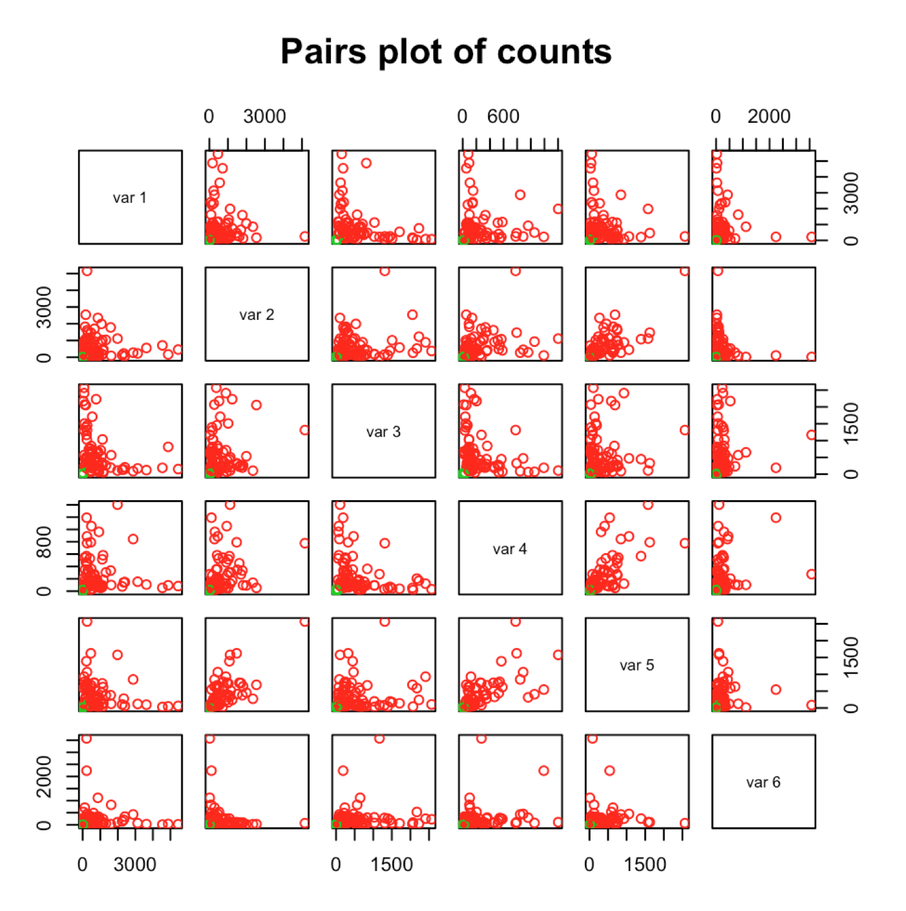
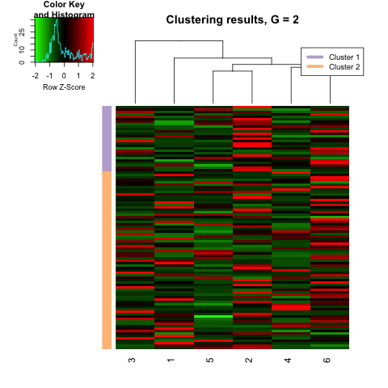
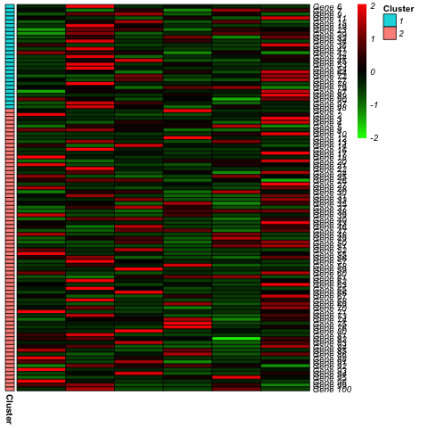
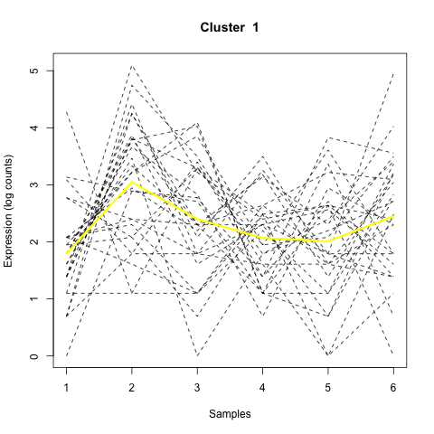

---
# This document was created based on the format used in mclust.rmd 
# Scrucca L., Fop M., Murphy T. B. and Raftery A. E. (2016) mclust 5:
#   clustering, classification and density estimation using Gaussian finite
#   mixture models The R Journal 8/1, pp. 205-233
# https://cran.r-project.org/web/packages/mclust/vignettes/mclust.html
--- 

---
title: "A quick tour of MPLNClust"
author: "Anjali Silva"
date: "`r format(Sys.time(), '%d %b %Y')`"
output: 
  rmarkdown::html_vignette:
    toc: true
    number_sections: false
vignette: >
  %\VignetteIndexEntry{A quick tour of MPLNClust}
  %\VignetteEngine{knitr::rmarkdown}
  %\VignetteEncoding{UTF-8}
---

```{r setup, include=FALSE}
library(knitr)
opts_chunk$set(fig.align = "center", 
               out.width = "90%",
               fig.width = 6, fig.height = 5.5,
               dev.args=list(pointsize=10),
               par = TRUE, # needed for setting hook 
               collapse = TRUE, # collapse input & ouput code in chunks
               warning = FALSE)

knit_hooks$set(par = function(before, options, envir)
  { if(before && options$fig.show != "none") 
       par(family = "sans", mar=c(4.1,4.1,1.1,1.1), mgp=c(3,1,0), tcl=-0.5)
})
set.seed(1) # for exact reproducibility
```
       
## Introduction

**MPLNClust** is an R package for model-based clustering based on finite multivariate Poisson-log normal mixture modelling. It provides functions for parameter estimation via the Markov chain Monte Carlo expectation-maximization (MCMC-EM) algorithm. Information criteria (AIC, BIC, AIC3 and ICL) and slope heuristics (Djump and DDSE, if applicable) are offered for model selection. Also included is a function for simulating data from this model. An additional functionality is available for displaying and visualizing clustering results. Function *mplnParallel* within **MPLNClust** makes use of the **parallel** R package to run each component/cluster (G) in parallel, as each G is independent from another. 

This document gives a quick tour of **MPLNClust** (version 0.1.0) functionalities. It was written in R Markdown, using the [knitr](https://cran.r-project.org/package=knitr) package for production. 
See `help(package = "MPLNClust")` for further details and references provided by `citation("MPLNClust")`. To download **MPLNClust**, use the following commands:

``` r
require("devtools")
install_github("anjalisilva/MPLNClust", build_vignettes = TRUE)
library("MPLNClust")
```


## Data Simulation

The function *mplnDataGenerator* permits to simulate data from a mixture of MPLN distrubutions. See *?mplnDataGenerator* for more information, an example, and references. To simulate a dataset from a mixture of MPLN with 100 observations and a dimensionality of 6, with two components, each with a mixing proportion of 0.79 and 0.21, respectively, let us use *mplnDataGenerator*. This also requires the mean and covariance matrix for each component respectively. 

``` r
nObservations <- 100 # Biological samples e.g., genes
dimensionality <- 6 # Dimensionality e.g., conditions * replicates = total samples 
pig <- c(0.79, 0.21) # Mixing proportions for two components

# Generate means
trueMu1 <- c(6.5, 6, 6, 5, 5, 5) # Mean for component 1  
trueMu2 <- c(2, 2.5, 2, 2, 2, 2) # Mean for component 2
tureMus <- rbind(trueMu1, trueMu2)

# Generate covariances
library(clusterGeneration)
set.seed(1)

# Covariance for component 1  
trueSigma1 <- clusterGeneration::genPositiveDefMat("unifcorrmat", 
                                  dim = dimensionality, 
                                  rangeVar = c(1, 1.5))$Sigma
# Covariance for component 2                                  
trueSigma2 <- clusterGeneration::genPositiveDefMat("unifcorrmat", 
                                  dim = dimensionality, 
                                  rangeVar = c(0.7, 0.7))$Sigma
trueSigma <- rbind(trueSigma1, trueSigma2)

# Generate data 
sampleData <- mplnDataGenerator(nObservations = nObservations,
                                dimensionality = dimensionality,
                                mixingProportions = pig,
                                mu = tureMus,
                                sigma = trueSigma,
                                produceImage = "Yes")

```
The user has the option to produce the plot of log-transformed count data. 

The generated dataset can be checked:
``` r
dim(sampleData$dataset) # 100 x 6 dataset
class(sampleData$dataset) # matrix
typeof(sampleData$dataset) # integer
summary(sampleData$dataset) # summary of data
pairs(sampleData$dataset, col = sampleData$trueMembership + 1,
      main = "Pairs plot of counts") # visualize counts
```


## Clustering

Once the count data is available, clustering can be performed using the *mplnParallel* or *mplnNonParallel* function. See *?mplnParallel* or *?mplnNonParallel* for more information, an example, and references. Here, clustering will be performed using the above generated dataset. 

### Parallel Clustering

Coarse grain parallelization is employed in *mplnParallel*, such that when a range of components/clusters (g = 1,...,G) are considered, each component/cluster size is run on a different processor. This can be performed because each component/cluster size is independent from another. All components/clusters in the range to be tested have been parallelized to run on a seperate core using the *parallel* R package. The number of cores used for clustering is internally determined using *parallel::detectCores() - 1*.

``` r
mplnResults <- mpln(dataset = sampleData$dataset,
                    membership = sampleData$truemembership,
                    gmin = 1,
                    gmax = 2,
                    nChains = 3,
                    nIterations = 500,
                    initMethod = "kmeans",
                    nInitIterations = 2,
                    normalize = "Yes")
```

The model selected by BIC for this dataset can be viewed as follows.

``` r
mplnResults$BIC_all$BICmodelselected

# Cross tabulation of BIC selected model labels with true lables
table(mplnResults$BIC_all$BICmodelselected_labels, sampleData$truemembership)
```

### Non Parallel Clustering

No internal parallelization is performed for *mplnNonParallel*. This permits the user to arrange own parallelization if necessary. This code will typically take longer than the *mplnParallel*, for same analysis. 

``` r
mplnResultsNonParallel <- mplnNonParallel(dataset = sampleData$dataset,
                                membership = sampleData$truemembership,
                                gmin = 1,
                                gmax = 2,
                                nChains = 3,
                                nIterations = 500,
                                initMethod = "kmeans",
                                nInitIterations = 2,
                                normalize = "Yes")
```

## Results Visualization

Clustering results can be viewed as heatmaps and line plots.

``` r
 # Visualizing results for model selected by BIC
 MPLNVisuals <- mplnVisualize(dataset = simulatedCounts$dataset,
                              clusterMembershipVector =
                        mplnResults$BIC_all$BICmodelselected_labels,
                               fileName = 'BICModel', plots = 'all',
                               format = 'png')
```






The first two images (above, left) show heatmaps of the results with observations (e.g., genes) along rows and samples along the columns. The last two images (above, right) show line plots of the two clusters. Values for each sample are connected by dashed lines to illustrate the trends of gene expression. The yellow line shows the mean gene expression level for each cluster. 

Rather than visualizing model selected by information criteria, labels for a specific component/cluster size can also be visualized. In the below example, the results for G = 2 model is visualized. 

``` r
 # Visualizing line plots for model with 2 components
 MPLNVisuals <- mplnVisualize(dataset = simulatedCounts$dataset,
                              clusterMembershipVector =
                     mplnResults$all_results[[2]]$all_results$clusterlabels,
                               fileName = 'TwoClusterModel', plots = 'line',
                               format = 'png')
```
\vspace{2in}

## References

[Silva, A., S. J. Rothstein, P. D. McNicholas, and S. Subedi (2019). A multivariate Poisson-log normal mixture model for clustering transcriptome sequencing data. *BMC Bioinformatics* 20. ](https://bmcbioinformatics.biomedcentral.com/articles/10.1186/s12859-019-2916-0)


----

```{r}
sessionInfo()
```
