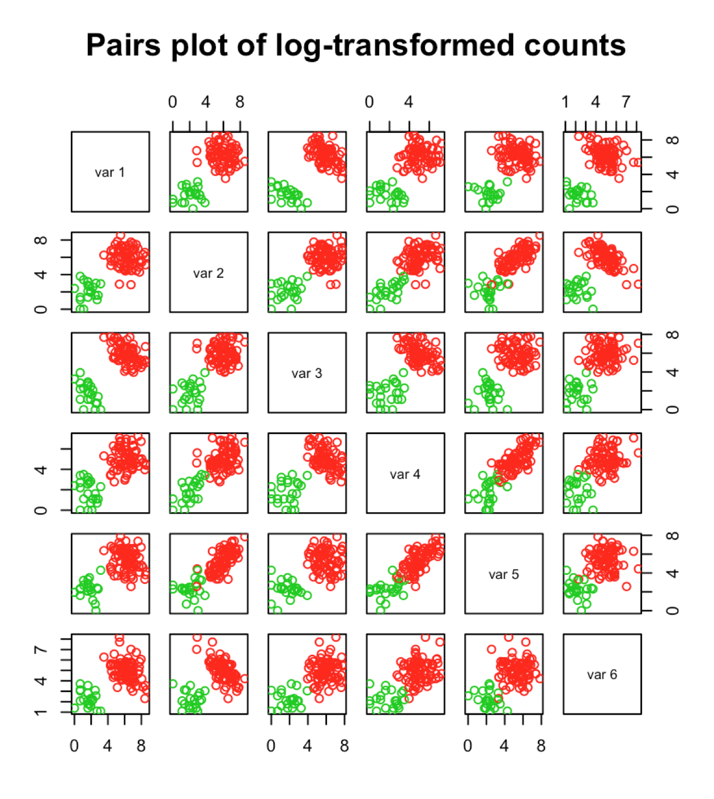
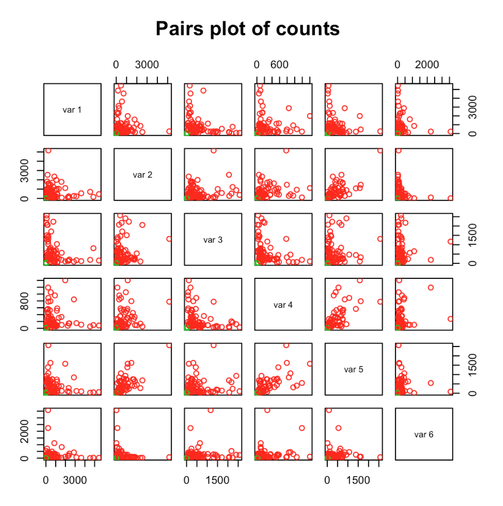
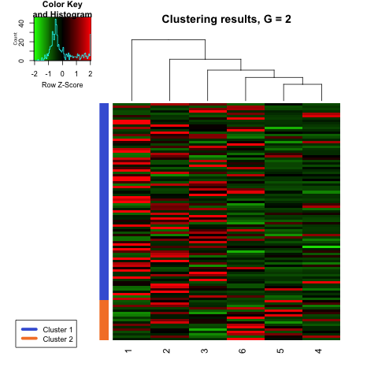
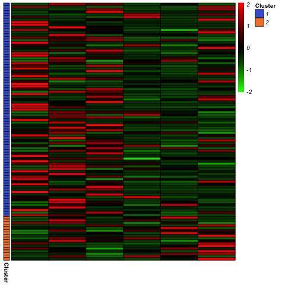
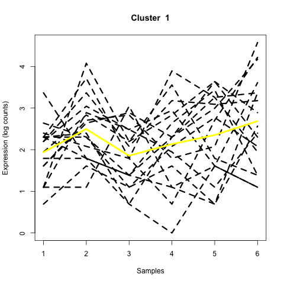
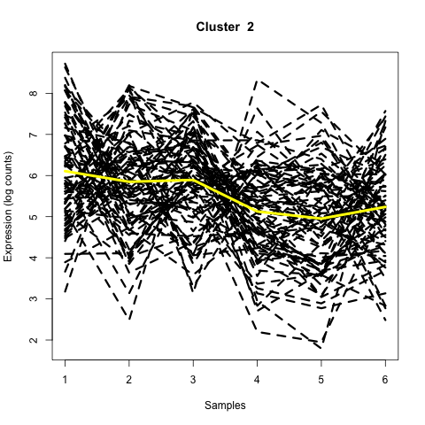
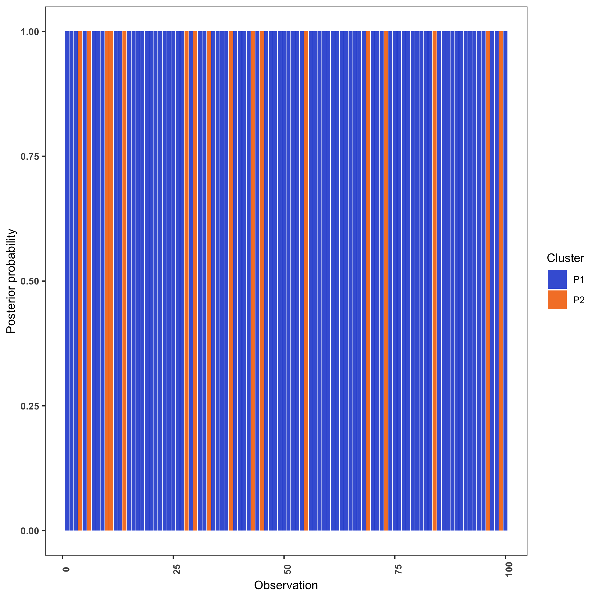
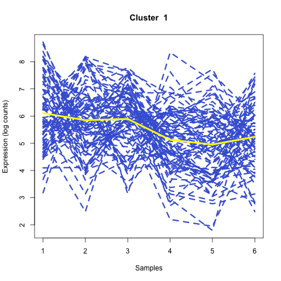
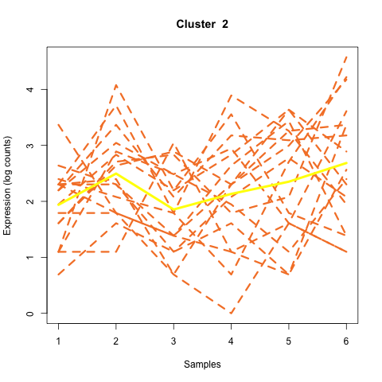
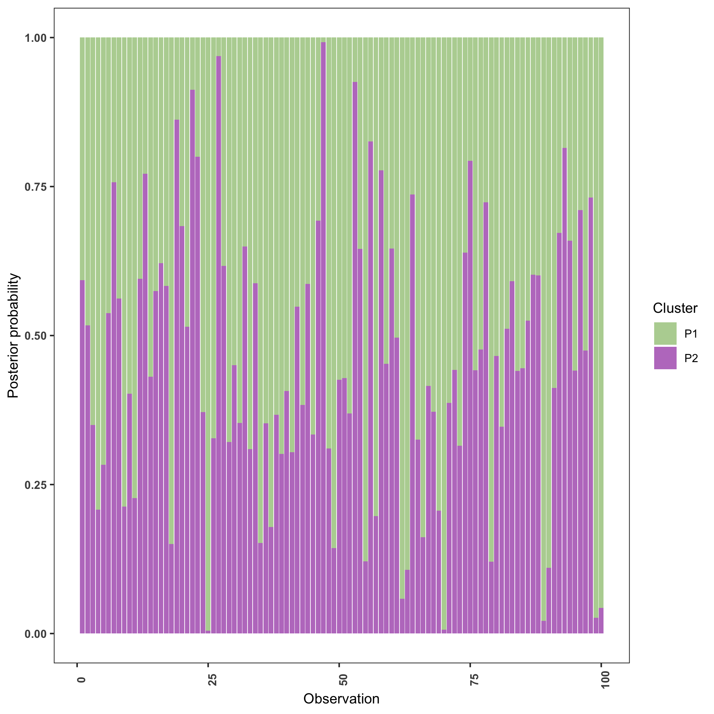

# A tour of MPLNClust with MCMC-EM

### Anjali Silva
### 25 Aug 2020

## Introduction

**MPLNClust** is an R package for model-based clustering based on finite multivariate Poisson-log normal mixture modelling proposed by [Silva et al., 2019](https://pubmed.ncbi.nlm.nih.gov/31311497/). It provides functions for parameter estimation via  1) an MCMC-EM framework by [Silva et al., 2019](https://pubmed.ncbi.nlm.nih.gov/31311497/) and 2) a variational Gaussian approximation with EM algorithm by [Subedi and Browne, 2020](https://arxiv.org/abs/2004.06857). Information criteria (AIC, BIC, AIC3 and ICL) and slope heuristics (Djump and DDSE, if more than 10 models are considered) are offered for model selection. Also included is a function for simulating data from this model. An additional functionality is available for displaying and visualizing clustering results. **This document gives a tour of MPLNClust (version 0.1.0) functionalities, here looking at methods of parameter estimation via  1) an MCMC-EM framework**. It was written in R Markdown, using the [knitr](https://cran.r-project.org/package=knitr) package for production. For MPLNClust (version 0.1.0) functionalities via 2) a variational Gaussian approximation with EM algorithm by [Subedi and Browne, 2020](https://arxiv.org/abs/2004.06857), see the other vignette: A tour of MPLNClust with variational-EM. 

See `help(package = "MPLNClust")` for further details and references provided by `citation("MPLNClust")`. To download **MPLNClust**, use the following commands:

``` r
require("devtools")
install_github("anjalisilva/MPLNClust", build_vignettes = TRUE)
library("MPLNClust")
```
To list all functions available in the package:
``` r
lsf.str("package:MPLNClust")
```

<br>


## Data Simulation

The function *mplnDataGenerator* permits to simulate data from a mixture of MPLN distributions. See *?mplnDataGenerator* for more information, an example, and references. To simulate a dataset from a mixture of MPLN with 100 observations and a dimensionality of 6, with two components, each with a mixing proportion of 0.79 and 0.21, respectively, let us use *mplnDataGenerator*. This also requires the mean and covariance matrix for each component, respectively. 

``` r
nObservations <- 100 # Biological samples e.g., genes
dimensionality <- 6 # Dimensionality e.g., conditions * replicates = total samples 
pig <- c(0.79, 0.21) # Mixing proportions for two components

# Generate means
trueMu1 <- c(6.5, 6, 6, 5, 5, 5) # Mean for component 1  
trueMu2 <- c(2, 2.5, 2, 2, 2, 2) # Mean for component 2
tureMus <- rbind(trueMu1, trueMu2)

# Generate covariances
library(clusterGeneration)
set.seed(1)

# Covariance for component 1  
trueSigma1 <- clusterGeneration::genPositiveDefMat("unifcorrmat", 
                                  dim = dimensionality, 
                                  rangeVar = c(1, 1.5))$Sigma
# Covariance for component 2                                  
trueSigma2 <- clusterGeneration::genPositiveDefMat("unifcorrmat", 
                                  dim = dimensionality, 
                                  rangeVar = c(0.7, 0.7))$Sigma
trueSigma <- rbind(trueSigma1, trueSigma2)

# Generate data 
sampleData <- MPLNClust::mplnDataGenerator(nObservations = nObservations,
                                          dimensionality = dimensionality,
                                          mixingProportions = pig,
                                          mu = trueMus,
                                          sigma = trueSigma,
                                          produceImage = "Yes")

```
<br>

The user has the option to produce the plot of log-transformed count data. 
<div style="text-align:center">
<div style="text-align:left">

The generated dataset can be checked:
``` r
dim(sampleData$dataset) # 100 x 6 dataset
class(sampleData$dataset) # matrix
typeof(sampleData$dataset) # integer
summary(sampleData$dataset) # summary of data
pairs(sampleData$dataset, col = sampleData$trueMembership + 1,
      main = "Pairs plot of counts") # visualize counts
```
<div style="text-align:center">
<div style="text-align:left">

<br>

<div style="text-align:left">
## Clustering via MCMC-EM
<div style="text-align:left">
Once the count data is available, clustering can be performed using the *mplnMCMCParallel* or *mplnMCMCNonParallel* function. See *?mplnMCMCParallel* or *?mplnMCMCNonParallel* for more information, an example, and references. 

The applicability of MPLNClust was originally illustrated using RNAseq data. Therefore, normalization is performed to account for library size differences. Currently, normalization factors are calculated using trimmed mean of M values (TMM) method of edgeR package.

Here, clustering will be performed using the above generated dataset. 

#### MCMC-EM Parallel Clustering

Coarse grain parallelization is employed in *mplnMCMCParallel*, such that when a range of components/clusters (g = 1,...,G) are considered, each component/cluster size is run on a different processor. This can be performed because each component/cluster (G) size is independent from another. All components/clusters in the range to be tested have been parallelized to run on a seperate core using the *parallel* R package. The number of cores used for clustering is internally determined using *parallel::detectCores() - 1*.

``` r
mplnResults <- MPLNClust::mplnMCMCParallel(dataset = sampleData$dataset,
                                           membership = sampleData$trueMembership,
                                           gmin = 1,
                                           gmax = 2,
                                           nChains = 3,
                                           nIterations = 500,
                                           initMethod = "kmeans",
                                           nInitIterations = 1,
                                           normalize = "Yes")
```

The model selected by BIC for this dataset can be viewed as follows.

``` r
mplnResults$BICresults$BICmodelselected
```

Tabulation of labels for the model selected by BIC:

``` r
table(mplnResults$BICresults$BICmodelSelectedLabels)
```

Labels from BIC compared with true labels:
``` r
# Cross tabulation of BIC selected model labels with true lables
table(mplnResults$BICresults$BICmodelSelectedLabels, sampleData$trueMembership)
```
   1  2<br>
1 83  0<br>
2  0 17<br>


If a range of components/clusters > 10 is considered (e.g., gmin = 1; gmax = 12), Djump and DDSE will be available in addition to AIC, BIC, AIC3 and ICL for model selection.

<br>

#### MCMC-EM Non-Parallel Clustering

No internal parallelization is performed for *mplnMCMCNonParallel*. This permits the user to arrange own parallelization if necessary. This code will typically take longer than the *mplnMCMCParallel*, for same analysis. 

``` r
mplnResultsNonParallel <- MPLNClust::mplnMCMCNonParallel(dataset = sampleData$dataset,
                                                         membership = sampleData$trueMembership,
                                                         gmin = 1,
                                                         gmax = 2,
                                                         nChains = 3,
                                                         nIterations = 500,
                                                         initMethod = "kmeans",
                                                         nInitIterations = 1,
                                                         normalize = "Yes")
```

<br>

## Results Visualization

Clustering results can be viewed as heatmaps and line plots. If a matrix of probabilities for the observations belonging to each cluster is provided, the option to produce a barplot of probabilities is also available.

``` r
 # Visualizing results for model selected by BIC using all plots; no probabilities provided
 MPLNVisuals <- MPLNClust::mplnVisualize(dataset = sampleData$dataset,
                                         plots = 'all',
                                         clusterMembershipVector =
                                          mplnResults$BICresults$BICmodelSelectedLabels,
                                         fileName = 'BICModel', 
                                         format = 'png')
```






The two images (above, left) show heatmaps of counts in the input dataset, with observations (e.g., genes) along rows and samples along the columns. The group membership based on clusters are shown to the left of heatmap. The last two images (above, right) show line plots of each cluster. Values for each sample are connected by dashed lines to illustrate the trends of expression (log counts). The yellow line shows the mean value (log counts) for each cluster. 

<br>

Rather than visualizing model selected by information criteria, labels for a specific component/cluster size can also be visualized. In the below example, the results for G = 2 model is visualized. Remember to alter file name to avoid overwriting. 

``` r
 # Visualizing line plots for model with 2 components
 MPLNVisuals <- MPLNClust::mplnVisualize(dataset = sampleData$dataset,
                                         plots = 'line',
                                         clusterMembershipVector =
                                         mplnResults$allResults[[2]]$allResults$clusterlabels,
                                         fileName = 'TwoComponentModel', 
                                         format = 'png')
```
<br>

By providing a matrix of probabilities for the observations belonging to each cluster, a barplot of probabilities can be produced.

``` r
 #  Visualizing line plots for model with 2 components provided probabilities
 MPLNVisuals <- MPLNClust::mplnVisualize(dataset = sampleData$dataset,
                                         plots = 'all',
                                         probabilities = mplnResults$allResults[[2]]$allResults$probaPost,
                                         clusterMembershipVector =
                                         mplnResults$allResults[[2]]$allResults$clusterlabels,
                                         LinePlotColours = "multicolour",
                                         fileName = 'AllPlotsWithProbability',
                                         format = 'png')
```
<div style="text-align:center">

Since argument *LinePlotColours = "multicolour"* was set, the line plots now can be visualized in color. 





<div style="text-align:left">
The above plot illustrates, for each observation, the probability of belonging to component/cluster 1 (P1) or probability of belonging to component/cluster 2 (P2). In this example, there were 100 observations in the dataset. The bar for each observation look monotone, indicating high confidence in belonging to the indicated component/cluster. 

<br>

In an alternative case (not tested here), which resulted in the below bar plot, indicates variability in probability of belonging to a component/cluster for a given observation. For example, for the first observation there is about 0.41 probability (P1) of belonging to component/cluster 1 and about a 0.59 probability (P2) of belonging to component/cluster 2. Therefore, it is assigned to component/cluster 2. Alternatively, for the 25th observation there is about 0.99 probability (P1) of belonging to component/cluster 1 and about 0.01 probability (P2) of belonging to component/cluster 2.  Therefore, it is assigned to component/cluster 1. 

<div style="text-align:center">
<div style="text-align:left">

<br>

<div style="text-align:left">

## Package References

[Silva, A., S. J. Rothstein, P. D. McNicholas, and S. Subedi (2019). A multivariate Poisson-log normal mixture model for clustering transcriptome sequencing data. *BMC Bioinformatics* 20. ](https://pubmed.ncbi.nlm.nih.gov/31311497/)


## Other References

[Aitchison, J. and C. H. Ho (1989). The multivariate Poisson-log normal distribution. Biometrika 76.](https://www.jstor.org/stable/2336624?seq=1)

[Akaike, H. (1973). Information theory and an extension of the maximum likelihood principle. In Second International Symposium on Information Theory, New York, NY, USA, pp. 267–281. Springer Verlag.](https://link.springer.com/chapter/10.1007/978-1-4612-1694-0_15)

[Arlot, S., Brault, V., Baudry, J., Maugis, C., and Michel, B. (2016). capushe: CAlibrating Penalities Using Slope HEuristics. R package version 1.1.1.](https://CRAN.R-project.org/package=capushe)

[Biernacki, C., G. Celeux, and G. Govaert (2000). Assessing a mixture model for clustering with the integrated classification likelihood. IEEE Transactions on Pattern Analysis and Machine Intelligence 22.](https://hal.inria.fr/inria-00073163/document)

[Bozdogan, H. (1994). Mixture-model cluster analysis using model selection criteria and a new informational measure of complexity. In Proceedings of the First US/Japan Conference on the Frontiers of Statistical Modeling: An Informational Approach: Volume 2 Multivariate Statistical Modeling, pp. 69–113. Dordrecht: Springer Netherlands.](https://link.springer.com/chapter/10.1007/978-94-011-0800-3_3)

[Rau, A., Celeux, G., Martin-Magniette, M.-L., Maugis-Rabusseau, C. (2011). Clustering high-throughput sequencing data with Poisson mixture models. Inria Research Report 7786.](http://hal.inria.fr/inria-00638082)

[Robinson, M.D., and Oshlack, A. (2010). A scaling normalization method for differential expression analysis of RNA-seq data. Genome Biology 11, R25.](https://genomebiology.biomedcentral.com/articles/10.1186/gb-2010-11-3-r25)

[Schwarz, G. (1978). Estimating the dimension of a model. The Annals of Statistics 6.](https://www.jstor.org/stable/2958889?seq=1)


----

