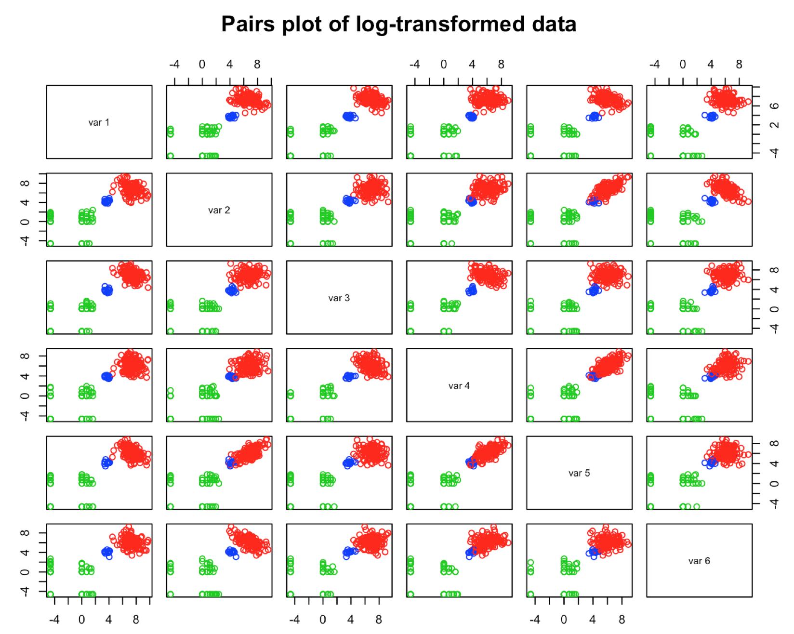
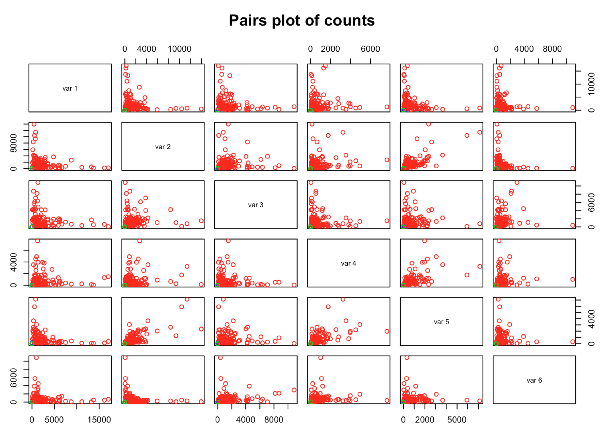
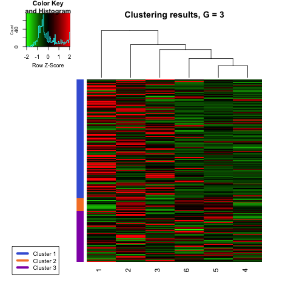
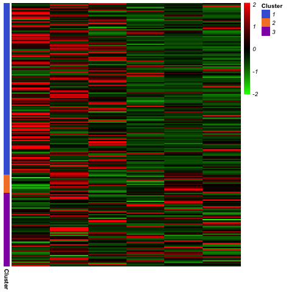
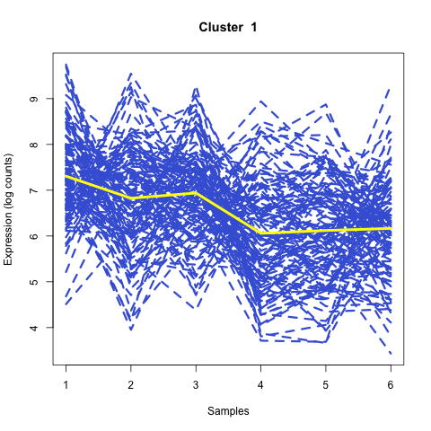
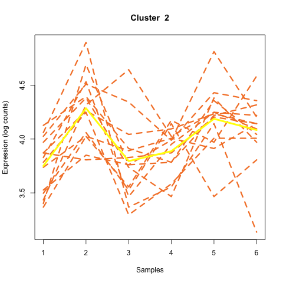
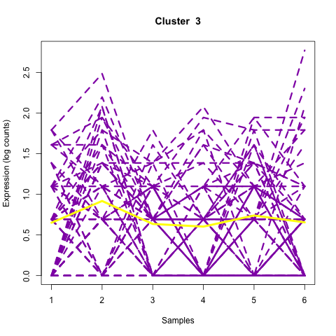
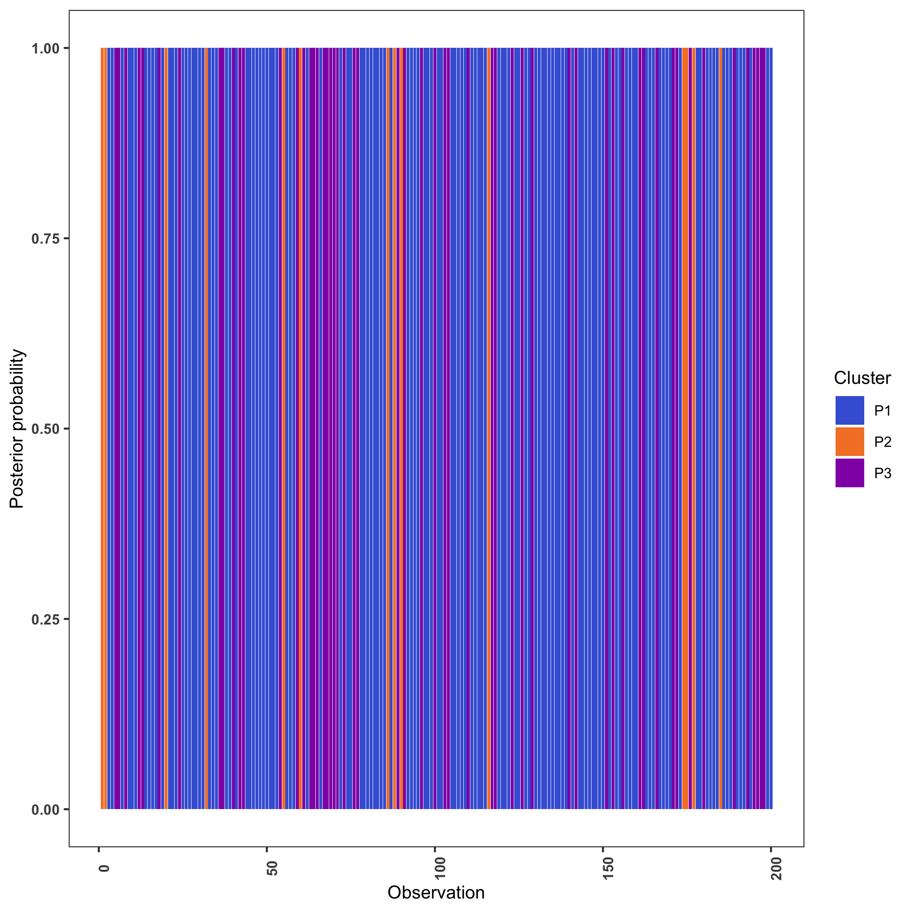
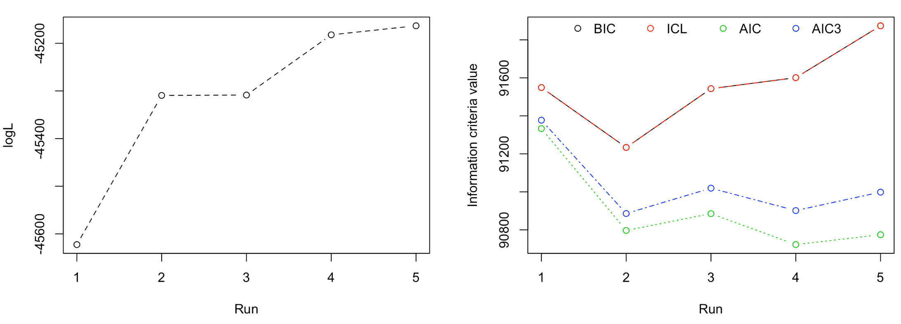
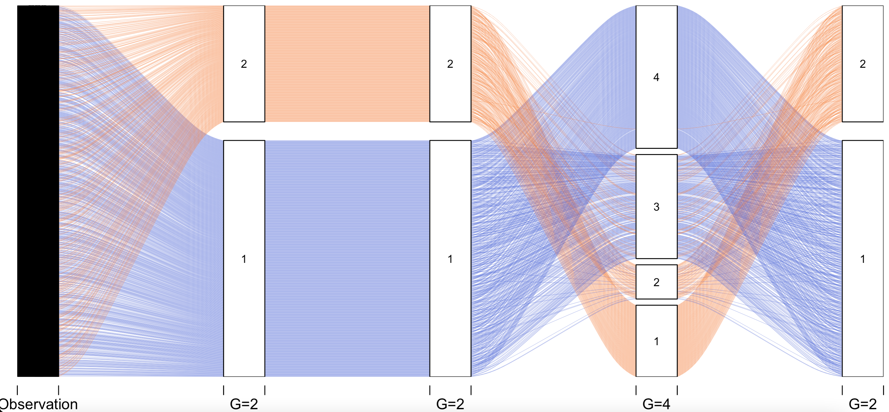

---
title: "A tour of MPLNClust with variational-EM"
author: "Anjali Silva"
date: "`r format(Sys.time(), '%d %b %Y')`"
output: 
  rmarkdown::html_vignette:
    toc: true
    number_sections: false
vignette: >
  %\VignetteIndexEntry{A tour of MPLNClust with variational-EM}
  %\VignetteEngine{knitr::rmarkdown}
  %\VignetteEncoding{UTF-8}
---

```{r setup, include=FALSE}
library(knitr)
opts_chunk$set(fig.align = "center", 
               out.width = "90%",
               fig.width = 6, fig.height = 5.5,
               dev.args=list(pointsize=10),
               par = TRUE, # needed for setting hook 
               collapse = TRUE, # collapse input & ouput code in chunks
               warning = FALSE)

knit_hooks$set(par = function(before, options, envir)
  { if(before && options$fig.show != "none") 
       par(family = "sans", mar=c(4.1,4.1,1.1,1.1), mgp=c(3,1,0), tcl=-0.5)
})
set.seed(1) # for exact reproducibility
```
       
## Introduction

**MPLNClust** is an R package for model-based clustering based on finite multivariate Poisson-log normal mixture modelling proposed by [Silva et al., 2019](https://pubmed.ncbi.nlm.nih.gov/31311497/). It provides functions for parameter estimation via  1) an MCMC-EM framework by [Silva et al., 2019](https://pubmed.ncbi.nlm.nih.gov/31311497/) and 2) a variational Gaussian approximation with EM algorithm by [Subedi and Browne, 2020](https://doi.org/10.1002/sta4.310). Information criteria (AIC, BIC, AIC3 and ICL) and slope heuristics (Djump and DDSE, if more than 10 models are considered) are offered for model selection. Also included is a function for simulating data from this model. An additional functionality is available for displaying and visualizing clustering results. **This document gives a tour of MPLNClust (version 0.1.0) functionalities, here looking at methods of parameter estimation via 2) a variational Gaussian approximation with EM algorithm by [Subedi and Browne, 2020](https://doi.org/10.1002/sta4.310)**. It was written in R Markdown, using the [knitr](https://cran.r-project.org/package=knitr) package for production. For MPLNClust functionalities via 1) an MCMC-EM framework, see the other vignette: A tour of MPLNClust with MCMC-EM. 


See `help(package = "MPLNClust")` for further details and references provided by `citation("MPLNClust")`. To download **MPLNClust**, use the following commands:

``` r
require("devtools")
install_github("anjalisilva/MPLNClust", build_vignettes = TRUE)
library("MPLNClust")
```
To list all functions available in the package:
``` r
ls("package:MPLNClust")
```

<br>


## Data Simulation

The function *mplnDataGenerator* permits to simulate data from a mixture of MPLN distributions. See *?mplnDataGenerator* for more information, an example, and references. To simulate a dataset from a mixture of MPLN with 200 observations and a dimensionality of 6, with three components, each with a mixing proportion of 0.6, 0.3 and 0.1, respectively, let us use *mplnDataGenerator*. This also requires the mean and covariance matrix for each component, respectively. 

``` r
nObservations <- 200 # Biological samples e.g., genes
dimensionality <- 6 # Dimensionality e.g., conditions * replicates = total samples 
pig <- c(0.6, 0.3, 0.1) # Mixing proportions for two components

# Generate means
trueMu1 <- c(7.5, 7, 7, 6, 6, 6) # Mean for component 1  
trueMu2 <- c(0, 0.5, 0, 0, 0, 0) # Mean for component 2
trueMu3 <- c(4, 4.5, 4, 4, 4, 4) # Mean for component 3
trueMus <- rbind(trueMu1, trueMu2, trueMu3)

# Generate covariances
library(clusterGeneration)
set.seed(1)
# Covariance for component 1  
trueSigma1 <- clusterGeneration::genPositiveDefMat("unifcorrmat", 
                                            dim = dimensionality, 
                                            rangeVar = c(1, 1))$Sigma
# Covariance for component 2                                  
trueSigma2 <- clusterGeneration::genPositiveDefMat("unifcorrmat", 
                                            dim = dimensionality, 
                                            rangeVar = c(0.7, 0.7))$Sigma
# Covariance for component 3                                
trueSigma3 <- clusterGeneration::genPositiveDefMat("unifcorrmat", 
                                            dim = dimensionality, 
                                            rangeVar = c(0.1, 0.1))$Sigma
trueSigma <- rbind(trueSigma1, trueSigma2, trueSigma3)

# Generate data 
sampleData <- MPLNClust::mplnDataGenerator(nObservations = nObservations,
                                          dimensionality = dimensionality,
                                          mixingProportions = pig,
                                          mu = trueMus,
                                          sigma = trueSigma,
                                          produceImage = "Yes")

```
<br>

The user has the option to produce the plot of log-transformed count data. 
<div style="text-align:center">
<div style="text-align:left">

The generated dataset can be checked:
``` r
dim(sampleData$dataset) # 200 x 6 dataset
class(sampleData$dataset) # matrix
typeof(sampleData$dataset) # integer
summary(sampleData$dataset) # summary of data
pairs(sampleData$dataset, col = sampleData$trueMembership + 1,
      main = "Pairs plot of counts") # visualize counts
```
<div style="text-align:center">
<div style="text-align:left">

<br>

<div style="text-align:left">


## Clustering via variational-EM
<div style="text-align:left">
Once the count data is available, clustering can be performed using the *mplnVariational* function. See *?mplnVariational* for more information, an example, and references. The variational Gaussian approximation proposed by [Subedi and Browne, 2020](https://doi.org/10.1002/sta4.310) alleviates challenges of MCMC-EM algorithm, originally used in [Silva et al., 2019](https://pubmed.ncbi.nlm.nih.gov/31311497/). Therefore, *mplnVariational* may perform better for large datasets compared to *mplnMCMCParallel* or *mplnMCMCNonParallel*.

The applicability of MPLNClust was originally illustrated using RNAseq data. Therefore, normalization is performed to account for library size differences. Currently, normalization factors are calculated using trimmed mean of M values (TMM) method of edgeR package.

Here, clustering will be performed using the above generated dataset. 

``` r
 mplnResults <- MPLNClust::mplnVariational(dataset = sampleData$dataset,
                                           membership = sampleData$trueMembership,
                                           gmin = 1,
                                           gmax = 4,
                                           initMethod = "kmeans",
                                           nInitIterations = 1,
                                           normalize = "Yes")
```

The model selected by BIC for this dataset can be viewed as follows.

``` r
mplnResults$BICresults$BICmodelselected
```

Tabulation of labels for the model selected by BIC:

``` r
table(mplnResults$BICresults$BICmodelSelectedLabels)
```
  1   2   3 <br>
130  14  56 <br>

Labels from BIC compared with true labels:
``` r
# Cross tabulation of BIC selected model labels with true lables
table(mplnResults$BICresults$BICmodelSelectedLabels, sampleData$trueMembership)
```
1   2   3 <br>
1 130   0   0 <br>
2   0   0  14 <br>
3   0  56   0 <br>


If a range of components/clusters > 10 is considered (e.g., gmin = 1; gmax = 12), Djump and DDSE will be available in addition to AIC, BIC, AIC3 and ICL for model selection.

<br>


## Results Visualization

Clustering results can be viewed as heatmaps and line plots. The two images below show heatmaps of counts in the input dataset, with observations (e.g., genes) along rows and samples along the columns. The group membership based on clusters are shown to the left of heatmap.

``` r
#  Visualizing line plots for model with 3 components provided probabilities
MPLNVisuals <- MPLNClust::mplnVisualizeBar(dataset = sampleData$dataset,
                                            probabilities = mplnResults$allResults[[3]]$allResults$probaPost,
                                            clusterMembershipVector =
                                            mplnResults$allResults[[3]]$allResults$clusterlabels,
                                            fileName = 'PlotsWithProbability')
```

<div style="text-align:center">



<br>

<div style="text-align:left">
Another type of plot available is a line plot, as shown below. 

``` r
 # Visualizing line plots for model with 3 components
 MPLNVisuals <- MPLNClust::mplnVisualizeLine(dataset = sampleData$dataset,
                                             plots = 'line',
                                             clusterMembershipVector =
                                             mplnResults$allResults[[3]]$allResults$clusterlabels,
                                             fileName = 'ThreeComponentModel', 
                                             format = 'png')
```

<div style="text-align:center">




<div style="text-align:left">
Three images above show line plots for each cluster. The values for each sample are connected by dashed lines to illustrate the trends of expression (log counts). The yellow line shows the mean value (log counts) for each cluster. If a matrix of probabilities for the observations belonging to each cluster is provided, the option to produce a barplot of probabilities is also available. Such a barplot is shown below. 

``` r
 #  Visualizing line plots for model with 3 components provided probabilities
 MPLNVisuals <- MPLNClust::mplnVisualizeBar(dataset = sampleData$dataset,
                                            probabilities = mplnResults$allResults[[3]]$allResults$probaPost,
                                            clusterMembershipVector =
                                            mplnResults$allResults[[3]]$allResults$clusterlabels,
                                            fileName = 'PlotWithProbability')
```

<br>
<div style="text-align:center">

<div style="text-align:left">
The above plot illustrates, for each observation, the probability of belonging to component/cluster 1 (P1), to component/cluster 2 (P2) or to component/cluster 3 (P3). In this example, there were 200 observations in the dataset. The bar for each observation look monotone, indicating high confidence in belonging to the indicated component/cluster. 

<br>
<div style="text-align:left">
In an alternative case (not tested here), which resulted in the below bar plot, indicates variability in probability of belonging to a component/cluster for a given observation. Here there are 2 clusters/components. As an example, for the first observation there is about 0.41 probability (P1) of belonging to component/cluster 1 and about a 0.59 probability (P2) of belonging to component/cluster 2. Therefore, it is assigned to component/cluster 2. Alternatively, for the 25th observation there is about 0.99 probability (P1) of belonging to component/cluster 1 and about 0.01 probability (P2) of belonging to component/cluster 2.  Therefore, it is assigned to component/cluster 1. 

<div style="text-align:center">
<div style="text-align:left">

<br>

<div style="text-align:left">
## Clustering Other Data
Here, an example dataset available in the package *MBCluster.Seq* is used.
``` r
# Obtain data available in package MBCluster.Seq
library(MBCluster.Seq)
data("Count")
dim(Count) # 1000    8

mplnResultsMBCluster <- MPLNClust::mplnVariational(dataset = Count,
                                          membership = "none",
                                          gmin = 1,
                                          gmax = 5,
                                          initMethod = "kmeans",
                                          nInitIterations = 1,
                                          normalize = "Yes")

```

The model selected by BIC for this dataset can be viewed as follows.

``` r
mplnResultsMBCluster$BICresults$BICmodelselected
```

Log-likelihood and BIC value at each run can be plotted as follows.

``` r
par(mfrow = c(1, 2))
graphics::matplot(mplnResultsMBCluster$logLikelihood, xlab = "G",
                  ylab = "logL", type = c("b"), pch = 1, lty = 2) 
ICvalues <- matrix(c(mplnResultsMBCluster$BICresults$allBICvalues,
              mplnResultsMBCluster$ICLresults$allICLvalues,
              mplnResultsMBCluster$AICresults$allAICvalues,
              mplnResultsMBCluster$AIC3results$allAIC3values),
              ncol=4) 
              
graphics::matplot(ICvalues, xlab = "G", ylab = "Information criteria value", type = c("b"), pch = 1, col = 1:4) 

legend("top", inset = c(- 0.4, 0), legend = c("BIC", "ICL", "AIC", "AIC3"), col = 1:4, pch = 1, horiz = TRUE, bty = "n")
```

<div style="text-align:center">
<div style="text-align:left">

<br>

<div style="text-align:left">

Finally, the different clustering results in terms of membership can be viewed via alluvial plots. Here, models selected by BIC, ICL, AIC and AIC3 can be visualized. The x-axis will show BIC, ICL, AIC and AIC3 results, respectively. Below is a plot of results saved in 'mplnResultsMBCluster'. The coloring is provided with respect to group membership vector assigned to argument 'firstGrouping', in this case those from BIC selected results. 
``` r
 #  Visualizing clustering results using alluvial plots 
                                            
MPLNVisualsAlluvial <- MPLNClust::mplnVisualizeAlluvial(nObservations = nrow(Count),
                                  firstGrouping = mplnResultsMBCluster$BICresults$BICmodelSelectedLabels,
                                  secondGrouping = mplnResultsMBCluster$ICLresults$ICLmodelSelectedLabels,
                                  thirdGrouping =  mplnResultsMBCluster$AICresults$AICmodelSelectedLabels,
                                  fourthGrouping = mplnResultsMBCluster$AIC3results$AIC3modelSelectedLabels,
                                  printPlot = FALSE)   
```

<div style="text-align:center">


<div style="text-align:left">
<div style="text-align:left">

## Package References

[Silva, A., S. J. Rothstein, P. D. McNicholas, and S. Subedi (2019). A multivariate Poisson-log normal mixture model for clustering transcriptome sequencing data. *BMC Bioinformatics* 20. ](https://pubmed.ncbi.nlm.nih.gov/31311497/)


[Subedi, S., and R. Browne (2020). A parsimonious family of multivariate Poisson-lognormal distributions for clustering multivariate count data. *Stat* 9:e310.](https://doi.org/10.1002/sta4.310)


## Other References

[Aitchison, J. and C. H. Ho (1989). The multivariate Poisson-log normal distribution. Biometrika 76.](https://www.jstor.org/stable/2336624?seq=1)

[Akaike, H. (1973). Information theory and an extension of the maximum likelihood principle. In Second International Symposium on Information Theory, New York, NY, USA, pp. 267–281. Springer Verlag.](https://link.springer.com/chapter/10.1007/978-1-4612-1694-0_15)

[Arlot, S., Brault, V., Baudry, J., Maugis, C., and Michel, B. (2016). capushe: CAlibrating Penalities Using Slope HEuristics. R package version 1.1.1.](https://CRAN.R-project.org/package=capushe)

[Biernacki, C., G. Celeux, and G. Govaert (2000). Assessing a mixture model for clustering with the integrated classification likelihood. IEEE Transactions on Pattern Analysis and Machine Intelligence 22.](https://hal.inria.fr/inria-00073163/document)

[Bozdogan, H. (1994). Mixture-model cluster analysis using model selection criteria and a new informational measure of complexity. In Proceedings of the First US/Japan Conference on the Frontiers of Statistical Modeling: An Informational Approach: Volume 2 Multivariate Statistical Modeling, pp. 69–113. Dordrecht: Springer Netherlands.](https://link.springer.com/chapter/10.1007/978-94-011-0800-3_3)

[Robinson, M.D., and Oshlack, A. (2010). A scaling normalization method for differential expression analysis of RNA-seq data. Genome Biology 11, R25.](https://genomebiology.biomedcentral.com/articles/10.1186/gb-2010-11-3-r25)

[Schwarz, G. (1978). Estimating the dimension of a model. The Annals of Statistics 6.](https://www.jstor.org/stable/2958889?seq=1)

[Si, Y. (2012). MBCluster.Seq: Model-Based Clustering for RNA-seq Data. R package version 1.0.](https://CRAN.R-project.org/package=MBCluster.Seq)


----

```{r}
sessionInfo()
```
